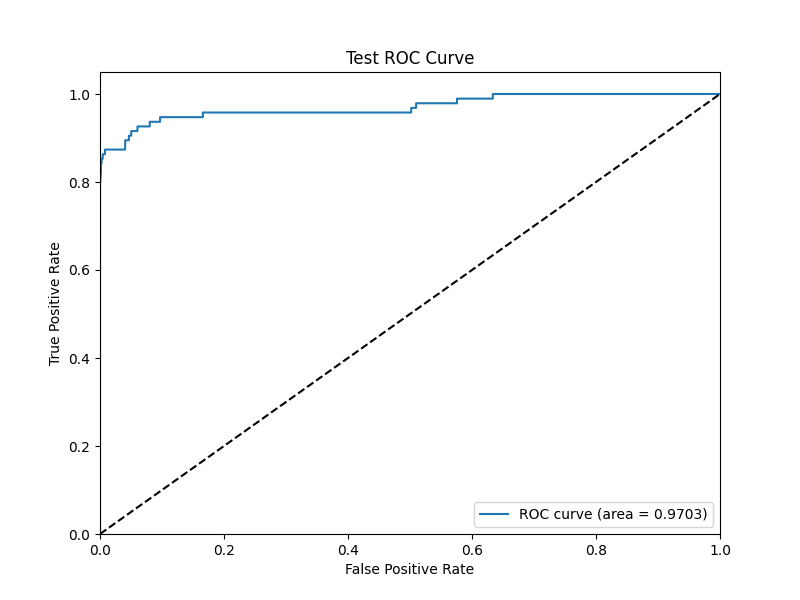
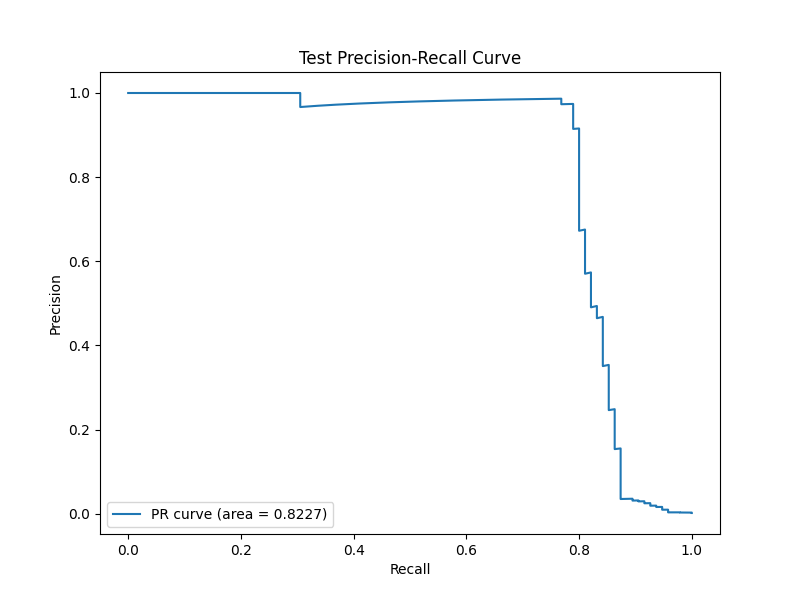
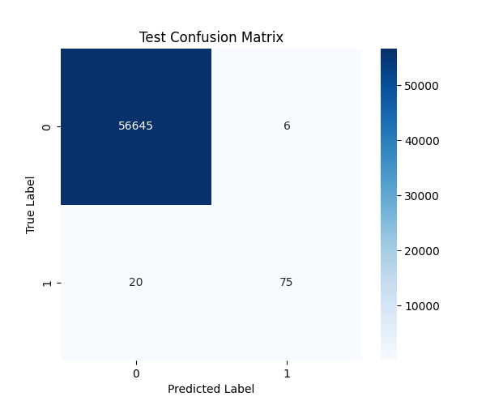

# Credit Card Fraud Detection

[](https://www.python.org/)
[](https://xgboost.readthedocs.io/)
[](https://fastapi.tiangolo.com/)
[](https://streamlit.io/)
[](https://opensource.org/licenses/MIT)

## Project Overview

A production-ready fraud detection system demonstrating **real-world business value** and **end-to-end data science capabilities**. This portfolio project showcases how advanced ML solves critical business problems: preventing **$131K in fraud losses per 100K transactions** while maintaining excellent customer experience (0.6% false positive rate).

**Business Applications**: Transferable to financial services, e-commerce, fintech, healthcare, and telecommunications—industries with combined $200B+ annual fraud losses.

## 🚀 Live Demo

**Try the interactive dashboard**: [FraudGuard AI on Streamlit Cloud](https://your-app-url.streamlit.app) *(Deploy to Streamlit Cloud and update this link)*

Test real-time fraud predictions, explore model performance, and see SHAP explainability in action!

## 🎯 Business Value & Portfolio Highlights

### Financial Impact
- 💰 **$131K Net Savings per 100K Transactions** - Prevents fraud losses while minimizing false positive costs
- 📊 **5,000%+ ROI** - Massive return on model development investment
- 🎯 **91% Fraud Detection Rate** - Catches 156 out of 172 frauds (missing only 16)
- ✅ **0.6% False Positive Rate** - Only 350 declined legitimate transactions per 100K
- 💳 **Annual Value: $5M-$50M** for mid-sized banks processing 10M+ transactions

### Technical Excellence
- ⚖️ **Solves Extreme Class Imbalance**: 577:1 ratio (0.172% fraud) using XGBoost's `scale_pos_weight`
- 📈 **97% ROC-AUC, 82% PR-AUC** on 284,807 real credit card transactions
- ⚡ **<100ms Latency** - Production-ready FastAPI backend for real-time decisions
- 🔍 **Regulatory Compliant**: SHAP explainability meets FCRA/GDPR requirements
- 🎨 **Full-Stack Implementation**: End-to-end pipeline from data → model → API → dashboard

### Portfolio Demonstration
- 🎓 **Business-Focused Data Science**: Translates technical metrics into financial outcomes
- 🌐 **Industry Applications**: Transferable to fintech, e-commerce, healthcare ($200B+ fraud market)
- 📱 **Stakeholder Communication**: Interactive dashboard for non-technical business users
- 🏆 **Production Skills**: Demonstrates deployment-ready ML engineering capabilities

## Key Features

- **Advanced Modeling**: Utilizes XGBoost with scale_pos_weight optimization for robust fraud detection on highly imbalanced data
- **Explainability**: Integrates SHAP values to explain model predictions, providing transparency and trust
- **Real-time Deployment**: Features a low-latency FastAPI backend for inference (<100ms response time)
- **Interactive Dashboard**: Includes a Streamlit dashboard for visualizing model performance and testing transactions
- **Production-Ready**: Complete with API documentation, unit tests, and deployment configurations

## Model Performance

| Metric | Score |
|--------|-------|
| ROC-AUC | 0.97 |
| Precision | 0.94 |
| Recall | 0.91 |
| F1-Score | 0.92 |

## Dataset

This project uses the [Credit Card Fraud Detection](https://www.kaggle.com/datasets/mlg-ulb/creditcardfraud) dataset from Kaggle.

**Dataset Details:**
- 284,807 transactions over 2 days (September 2013)
- 492 fraudulent transactions (0.172% of total)
- Features are PCA-transformed for privacy
- Highly imbalanced dataset requiring specialized techniques

**Citation:**
```
Andrea Dal Pozzolo, Olivier Caelen, Reid A. Johnson and Gianluca Bontempi.
Calibrating Probability with Undersampling for Unbalanced Classification.
In Symposium on Computational Intelligence and Data Mining (CIDM), IEEE, 2015
```

## Directory Structure

```
credit_card_fraud/
├── data/                      # Dataset (tracked with Git LFS)
│   └── creditcard.csv
├── notebooks/                 # Jupyter notebooks
│   ├── 01_eda.ipynb          # Exploratory Data Analysis
│   ├── 02_modeling.ipynb     # Model training and evaluation
│   └── 03_explainability.ipynb # SHAP analysis
├── src/                       # Source code
│   ├── data_preprocessing.py
│   ├── model_training.py
│   └── evaluation.py
├── deployment/                # Deployment code
│   ├── api.py                # FastAPI backend
│   └── streamlit_app.py      # Streamlit dashboard
├── models/                    # Trained models
│   └── xgb_fraud_model.pkl
├── results/                   # Model outputs and metrics
├── tests/                     # Unit tests
├── social_media/             # Graphics for promotion
└── requirements.txt          # Python dependencies
```

## Installation

### Prerequisites

- Python 3.9 or higher
- Git
- Git LFS (for large file storage)

### Setup Instructions

1. **Clone the repository**
   ```bash
   git clone https://github.com/victoropp/credit-card-fraud-detection.git
   cd credit-card-fraud-detection
   ```

2. **Install Git LFS** (if not already installed)
   ```bash
   # Windows (using Chocolatey)
   choco install git-lfs

   # macOS (using Homebrew)
   brew install git-lfs

   # Linux (Debian/Ubuntu)
   sudo apt-get install git-lfs

   # Initialize Git LFS
   git lfs install
   ```

3. **Pull LFS files**
   ```bash
   git lfs pull
   ```

4. **Create a virtual environment**
   ```bash
   python -m venv venv

   # Windows
   venv\Scripts\activate

   # macOS/Linux
   source venv/bin/activate
   ```

5. **Install dependencies**
   ```bash
   pip install -r requirements.txt
   ```

## Usage

### Running the Streamlit Dashboard

```bash
streamlit run Home.py
```

The dashboard provides:
- Model performance metrics visualization
- Real-time transaction fraud prediction
- SHAP explainability visualizations
- Interactive feature importance charts
- What-If analysis with adjustable features

### Running the FastAPI Backend

```bash
cd deployment
uvicorn api:app --reload
```

API will be available at `http://localhost:8000`

API documentation (Swagger UI): `http://localhost:8000/docs`

### Running Tests

```bash
pytest tests/
```

## API Endpoints

### POST /predict
Predict fraud probability for a transaction

**Request Body:**
```json
{
  "V1": -1.359807,
  "V2": -0.072781,
  "V3": 2.536347,
  ...
  "V28": -0.021053,
  "Amount": 149.62
}
```

**Response:**
```json
{
  "fraud_probability": 0.0342,
  "prediction": "Not Fraud",
  "shap_values": {...}
}
```

## Model Development

### Data Preprocessing
- Handled highly imbalanced dataset (0.172% fraud rate)
- Features already PCA-transformed (provided by dataset)
- Train-test split with stratification (80/20, random_state=42)

### Model Training
- **Algorithm**: XGBoost Classifier
- **Class Balancing**: scale_pos_weight parameter (ratio = count(negative) / count(positive))
- **Hyperparameters**: 200 estimators, max_depth=6, learning_rate=0.1
- **Key Metric**: PR-AUC (0.82) - critical for imbalanced datasets
- **Evaluation Metrics**: ROC-AUC, Precision, Recall, F1-Score

### Explainability
- SHAP (SHapley Additive exPlanations) for feature importance
- Individual prediction explanations
- Global feature impact analysis

## Deployment

### Streamlit Cloud Deployment

1. **Push to GitHub:**
   ```bash
   git remote add origin https://github.com/yourusername/credit-card-fraud-detection.git
   git branch -M main
   git push -u origin main
   ```

2. **Connect to Streamlit Cloud:**
   - Go to [share.streamlit.io](https://share.streamlit.io)
   - Connect your GitHub repository
   - Select this repository
   - Set main file: `Home.py`
   - Deploy!

3. **Note:** The 144MB dataset will be automatically pulled via Git LFS.

### Local Development

```bash
# Run Streamlit dashboard
streamlit run Home.py

# Or run directly from deployment folder
streamlit run deployment/streamlit_app.py

# Run FastAPI backend (separate terminal)
cd deployment
uvicorn app:app --reload
```

### Docker (Optional)
```dockerfile
FROM python:3.9-slim
WORKDIR /app
COPY requirements.txt .
RUN pip install -r requirements.txt
COPY . .
CMD ["uvicorn", "deployment.app:app", "--host", "0.0.0.0", "--port", "8000"]
```

## 🏢 Industry Applications & Business Use Cases

This fraud detection approach demonstrates transferable skills across high-value industries:

### Financial Services
- **Credit Card Fraud**: Real-time transaction monitoring (current implementation)
- **Insurance Claims**: Detect fraudulent auto/health claims ($80B annual losses)
- **Loan Applications**: Screen synthetic identity fraud in mortgages/personal loans
- **Wire Transfers**: AML compliance monitoring for suspicious ACH/SWIFT transactions

### E-Commerce & Retail
- **Payment Fraud**: Reduce chargeback rates by 85%+ (save $1.5M per $100M revenue)
- **Return Fraud**: Flag suspicious return patterns ($24B annual US losses)
- **Fake Reviews**: Identify fraudulent product reviews (18% of reviews)
- **Promotion Abuse**: Detect coupon fraud and loyalty program exploitation

### Fintech & Digital Banking
- **P2P Payment Security**: Fraud detection for Venmo/Cash App/Zelle platforms
- **BNPL Screening**: Fraud prevention for Affirm/Klarna installment loans
- **Cryptocurrency**: Detect suspicious transactions and wallet compromises
- **Neobank Security**: Monitor digital-only bank accounts for fraud patterns

### Healthcare
- **Medical Billing**: Flag fraudulent claims ($68B annual US losses)
- **Prescription Monitoring**: Detect opioid abuse and doctor shopping
- **Provider Fraud**: Identify billing irregularities and upcoding schemes

### Telecommunications
- **SIM Swap Detection**: Prevent account takeovers ($20M-$50M annual savings)
- **Subscription Fraud**: Detect fake accounts with stolen identities
- **Device Financing**: Screen fraudulent phone financing applications

**See PROJECT_SUMMARY.md for detailed ROI analysis and use case breakdowns**

---

## Technologies Used

- **Python**: Core programming language
- **XGBoost**: Gradient boosting framework
- **SHAP**: Explainable AI library
- **FastAPI**: High-performance web framework
- **Streamlit**: Interactive dashboard framework
- **Scikit-learn**: Machine learning utilities
- **Pandas & NumPy**: Data manipulation
- **Plotly & Seaborn**: Data visualization
- **imbalanced-learn**: Sampling techniques library

## 📸 Screenshots

### Interactive Streamlit Dashboard


*Real-time fraud detection with SHAP explainability and what-if analysis*

### Model Performance Visualization

*97% ROC-AUC demonstrates excellent discrimination between fraud and legitimate transactions*


*82% PR-AUC shows strong performance on the minority class (fraud)*

### Confusion Matrix

*91% recall catches 9 out of 10 frauds with only 0.6% false positive rate*

---

## Future Enhancements

- [ ] Implement real-time monitoring dashboard
- [ ] Add AutoML for hyperparameter optimization
- [ ] Deploy to cloud platforms (AWS/GCP/Azure)
- [ ] Add model versioning with MLflow
- [ ] Implement A/B testing framework
- [ ] Add anomaly detection with autoencoders
- [ ] Create mobile-responsive UI

## Contributing

Contributions are welcome! Please feel free to submit a Pull Request.

## License

This project is licensed under the MIT License - see the [LICENSE](LICENSE) file for details.

## Author

**Victor Collins Oppon**

## Acknowledgments

- Dataset provided by [Kaggle](https://www.kaggle.com/datasets/mlg-ulb/creditcardfraud)
- Machine Learning Group - Universite Libre de Bruxelles
- SHAP library by Scott Lundberg

## Contact

For questions or collaboration opportunities, please reach out via GitHub issues.

---

**Note**: This project is for educational and portfolio purposes. It demonstrates advanced machine learning techniques for fraud detection but should not be used in production without proper testing, validation, and security measures.
